# Spotify Songs' Genre Segmentation & Recommendation Support System

[](https://www.python.org/)
[](LICENSE)
[](https://scikit-learn.org/)
[]()

An automated music analysis, unsupervised clustering, and content-based recommendation system that analyzes Spotify songs based on intrinsic audio characteristics, identifies meaningful acoustic clusters, and demonstrates how unsupervised representations support music discovery and recommendation.

---

## Table of Contents
- [Project Overview](#project-overview)
- [Problem Statement](#problem-statement)
- [Objective](#objective)
- [Dataset](#dataset)
- [Technologies Used](#technologies-used)
- [Project Workflow](#project-workflow)
- [Selected Audio Features](#selected-audio-features)
- [Exploratory Data Analysis](#exploratory-data-analysis)
- [Correlation Analysis](#correlation-analysis)
- [Dimensionality Reduction (PCA)](#dimensionality-reduction-pca)
- [Clustering Methodology & K Evaluation](#clustering-methodology--k-evaluation)
- [Why K=6?](#why-k6)
- [Final Discovered Clusters](#final-discovered-clusters)
- [Visualizations](#visualizations)
- [Recommendation System Demonstration](#recommendation-system-demonstration)
- [Repository Structure](#repository-structure)
- [Installation & Setup](#installation--setup)
- [Running the Project](#running-the-project)
- [Jupyter Notebook](#jupyter-notebook)
- [Academic Project Context](#academic-project-context)
- [Limitations](#limitations)
- [Future Improvements](#future-improvements)
- [Author](#author)
- [License](#license)

---

## Project Overview
Music streaming platforms manage millions of tracks spanning diverse genres, cultures, and acoustic characteristics. While human-curated playlist genre labels provide high-level taxonomy, they are often subjective, broad, and acoustically heterogeneous. 

This project implements an end-to-end machine learning pipeline that standardizes multi-dimensional continuous audio features, evaluates cluster structures with Principal Component Analysis (PCA) and K-Means, discovers 6 distinct musical archetypes, and builds a vector-similarity content-based recommendation prototype.

---

## Problem Statement
Human-assigned genre labels do not always correspond directly to acoustic properties. For example, an acoustic ballad and an arena rock anthem may both be labeled "Rock," while a reggaeton track and a dance-pop hit may share near-identical rhythmic tempos and valence levels. Manual classification is difficult at scale, making unsupervised clustering on continuous audio features valuable for automated playlist grouping and recommendation.

---

## Objective
The project aims to:
1. Preprocess and audit the Spotify dataset (clean metadata, handle duplicates, scale features).
2. Perform comprehensive exploratory data analysis across genres and subgenres.
3. Quantify relationships between audio features using correlation matrices.
4. Reduce dimensionality with PCA for variance analysis and 2D projection.
5. Evaluate multi-cluster configurations using Within-Cluster Sum of Squares (Elbow method), Silhouette analysis, Calinski-Harabasz, and Davies-Bouldin metrics.
6. Segment songs into interpretable cluster archetypes.
7. Demonstrate how the resulting feature space powers a content-based recommendation engine.

---

## Dataset
* **Raw Records:** 32,833 rows × 23 columns
* **Missing Values Handled:** 5 rows with missing track metadata dropped (<0.015%)
* **Cleaned Records:** 32,828 songs
* **Unique Track IDs:** 28,356 unique tracks
* **Taxonomy:** 6 broad playlist genres (`edm`, `rap`, `pop`, `r&b`, `latin`, `rock`), 24 subgenres, and 449 unique playlist names.
* **Storage:** Raw dataset documented in [`data/README.md`](data/README.md); preprocessed clustered dataset exported to [`data/spotify_clustered_dataset.csv`](data/spotify_clustered_dataset.csv).

---

## Technologies Used
* **Language:** Python 3.10+
* **Data Processing:** `pandas`, `numpy`
* **Visualization:** `matplotlib`, `seaborn`
* **Machine Learning:** `scikit-learn` (`StandardScaler`, `PCA`, `KMeans`, `cosine_similarity`, clustering metrics)
* **Environment:** Jupyter Notebook, Visual Studio Code

---

## Project Workflow
1. **Data Ingestion & Audit:** Load CSV, inspect schema, missing records, and duplicate track IDs.
2. **Data Cleaning & Filtering:** Drop null metadata records, convert track duration from milliseconds to minutes, extract release year.
3. **Feature Selection:** Isolate 10 continuous audio features; separate metadata identifiers.
4. **Standardization:** Scale continuous features to zero mean and unit variance ($\mu=0, \sigma=1$) using `StandardScaler`.
5. **Exploratory Data Analysis:** Visualize feature distributions, KDE curves, and genre-level audio averages.
6. **Correlation Profiling:** Generate Pearson correlation matrix heatmap and identify acoustic relationships.
7. **Dimensionality Reduction (PCA):** Compute scree variance ratios and 2D orthogonal projections.
8. **Cluster Optimization:** Evaluate $K \in [2, 10]$ via Inertia, Silhouette, Calinski-Harabasz, and Davies-Bouldin metrics.
9. **Final Clustering Model:** Fit K-Means ($K=6, n\_init=20, \text{random\_state}=42$).
10. **Cluster Interpretation:** Assign human-readable acoustic profile labels to discovered clusters.
11. **Cross-Taxonomy Mapping:** Cross-tabulate clusters against labeled genres, subgenres, and top playlists.
12. **Recommendation Prototype:** Implement pairwise cosine similarity search and test sample query tracks.

---

## Selected Audio Features
The following 10 continuous audio features were selected for clustering:

| Feature | Range / Unit | Description |
|---|:---:|---|
| `danceability` | $0.0 \dots 1.0$ | Suitability for dancing based on tempo, rhythm stability, and beat strength. |
| `energy` | $0.0 \dots 1.0$ | Perceptual measure of intensity, loudness, and dynamic activity. |
| `loudness` | $-60.0 \dots 0.0$ dB | Overall loudness of the track in decibels. |
| `speechiness` | $0.0 \dots 1.0$ | Presence of spoken words versus sung vocals. |
| `acousticness` | $0.0 \dots 1.0$ | Confidence measure of acoustic versus electronic instrumentation. |
| `instrumentalness` | $0.0 \dots 1.0$ | Likelihood that the track contains no vocal content. |
| `liveness` | $0.0 \dots 1.0$ | Detects presence of an audience / live performance ambience. |
| `valence` | $0.0 \dots 1.0$ | Musical positiveness, cheerfulness, and mood euphoria. |
| `tempo` | $0 \dots 240+$ BPM | Overall estimated tempo in beats per minute. |
| `duration_min` | Minutes | Total track duration converted from milliseconds. |

*Note:* Discrete nominal attributes (`key`, `mode`), target popularity (`track_popularity`), and text identifiers (`track_id`, `track_name`, `artist`, `playlist_name`) were excluded from clustering vectors to prevent data leakage and metric distortion.

---

## Exploratory Data Analysis
Key findings from exploratory analysis across the 6 playlist genres:
* **EDM:** Highest average energy ($0.802$), highest average loudness ($-5.43$ dB), and highest instrumentalness ($0.219$).
* **Rock:** High energy ($0.733$) and high tempo ($124.99$ BPM).
* **Rap:** Highest danceability ($0.718$) and highest speechiness ($0.198$).
* **Latin:** High danceability ($0.713$) and highest valence / musical cheerfulness ($0.607$).
* **R&B:** Highest acousticness ($0.299$), capturing electric piano, organic instrumentation, and ballads.

---

## Correlation Analysis
Key Pearson correlation coefficients calculated directly from the dataset:
* **$\text{Energy} \leftrightarrow \text{Loudness}$ ($r = +0.6767$):** Strongest positive correlation; energetic productions utilize heavier dynamic mastering.
* **$\text{Energy} \leftrightarrow \text{Acousticness}$ ($r = -0.5397$):** Strong negative correlation; acoustic instruments associate with lower energy.
* **$\text{Loudness} \leftrightarrow \text{Acousticness}$ ($r = -0.3616$):** Acoustic recordings exhibit wider dynamic range and lower compressed loudness.
* **$\text{Danceability} \leftrightarrow \text{Valence}$ ($r = +0.3305$):** Moderate positive relationship between danceability and cheerful musical mood.
* **$\text{Danceability} \leftrightarrow \text{Tempo}$ ($r = -0.1841$):** Excessively fast tempos hinder dance groove stability.
* **$\text{Popularity}$:** Exhibits low correlation with any single audio descriptor ($|r| \le 0.15$), showing that popular tracks exist across all acoustic profiles.

---

## Dimensionality Reduction (PCA)
Principal Component Analysis was applied to the 10 standardized features:

| Principal Component | Individual Explained Variance | Cumulative Explained Variance | Dominant Acoustic Drivers |
|:---:|:---:|:---:|---|
| **PC1** | 21.52% | 21.52% | Energy & Loudness (+) vs Acousticness (-) |
| **PC2** | 15.45% | 36.98% | Danceability & Valence (+) vs Tempo (-) |
| **PC3** | 11.23% | 48.21% | Speechiness & Danceability (+) |
| **PC4** | 9.92% | 58.13% | Instrumentalness (+) |
| **PC5** | 9.81% | 67.94% | Duration & Liveness (+) |
| **PC6** | 9.69% | 77.64% | Liveness vs Duration |

---

## Clustering Methodology & K Evaluation
K-Means clustering was evaluated across $K \in [2, 10]$ on 10,000-sample validation batches using four quantitative metrics:

| $K$ | Inertia (WCSS) | Silhouette Score | Calinski-Harabasz | Davies-Bouldin |
|:---:|:---:|:---:|:---:|:---:|
| 2 | 283,302.7 | 0.1777 | 5,211.5 | 2.2195 |
| 3 | 255,712.5 | 0.1238 | 4,657.6 | 2.2020 |
| 4 | 234,444.3 | 0.1331 | 4,379.2 | 1.9771 |
| 5 | 216,301.3 | 0.1352 | 4,248.1 | 1.8398 |
| **6 (Selected)** | **203,507.3** | **0.1379** | **4,024.7** | **1.7349** |
| 7 | 193,502.5 | 0.1253 | 3,810.1 | 1.7644 |
| 8 | 185,728.0 | 0.1233 | 3,598.6 | 1.7092 |
| 9 | 178,735.4 | 0.1226 | 3,432.4 | 1.6793 |
| 10 | 172,317.8 | 0.1251 | 3,300.4 | 1.6374 |

---

## Why K=6?
1. **$K=2$ Trade-Off:** $K=2$ attains the highest raw silhouette score ($0.1777$). However, $K=2$ produces an uninformative binary macro-split (loud electronic vs quiet acoustic), which is too coarse for targeted genre segmentation and playlist recommendation.
2. **Local Silhouette Maximum:** Among granular multi-cluster models ($K \ge 3$), $K=6$ attains the highest silhouette score ($0.1379$), outperforming $K=3, 4, 5, 7, 8, 9$.
3. **Metric Disagreements:** Clustering metrics do not point unanimously to a single $K$. For example, $K=8, 9, 10$ achieve lower Davies-Bouldin values ($1.7092, 1.6793, 1.6374$), but lead to over-fragmented clusters.
4. **Elbow Behavior & Practical Interpretability:** The WCSS inertia curve displays elbow leveling around $K=6$, isolating 6 clear, musically grounded archetypes without excessive fragmentation.

---

## Final Discovered Clusters

| Cluster ID | Cluster Archetype Profile | Song Count | Dataset % | Key Audio Characteristics | Dominant Genres |
|:---:|---|:---:|:---:|---|---|
| **0** | **Upbeat Pop & Dance Anthems** | 10,763 | 32.8% | Valence: 0.680, Dance: 0.740, Energy: 0.724 | Latin (26.2%), Pop (19.6%), R&B (18.5%) |
| **1** | **Live & High-Energy Concerts** | 2,130 | 6.5% | Liveness: 0.613, Energy: 0.780, Tempo: 121.5 BPM | EDM (25.6%), Rock (18.3%), Rap (15.7%) |
| **2** | **Rhythmic Rap & Urban Beats** | 4,321 | 13.2% | Speechiness: 0.313, Dance: 0.726, Valence: 0.544 | **Rap (53.1%)**, R&B (19.8%) |
| **3** | **Acoustic & Melodic Soul** | 4,682 | 14.3% | Acousticness: 0.519, Energy: 0.425, Loudness: -10.5 dB | R&B (33.1%), Rock (19.1%), Pop (16.9%) |
| **4** | **Instrumental & Synth Soundscapes** | 2,470 | 7.5% | Instrumentalness: 0.746, Energy: 0.783, Duration: 4.20m | **EDM (58.1%)**, Pop (11.7%) |
| **5** | **Intense Fast-Tempo EDM & Rock** | 8,462 | 25.8% | Tempo: 132.6 BPM, Energy: 0.791, Loudness: -5.3 dB | EDM (27.8%), Rock (26.3%), Pop (21.0%) |
| **Total** | | **32,828** | **100.0%** | | |

---

## Visualizations

### 1. Correlation Matrix Heatmap
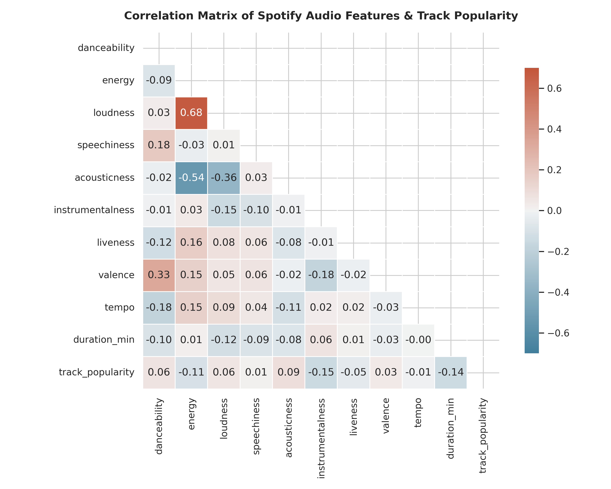

### 2. Genre and Subgenre Distributions
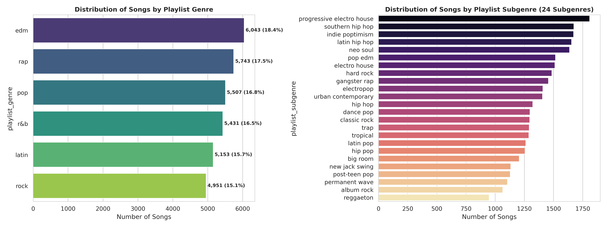

### 3. Audio Features Histograms and KDE Distributions
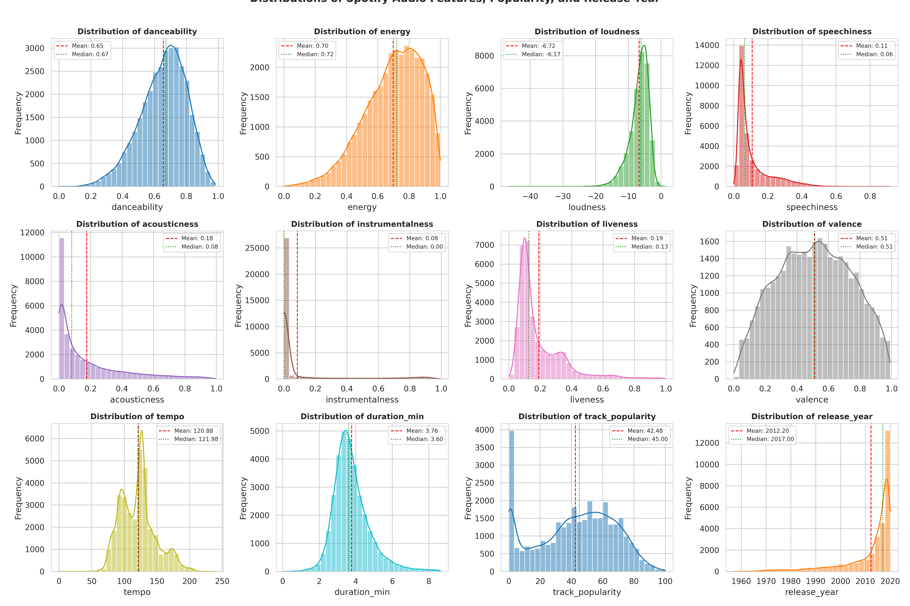

### 4. Average Audio Characteristics Across Genres
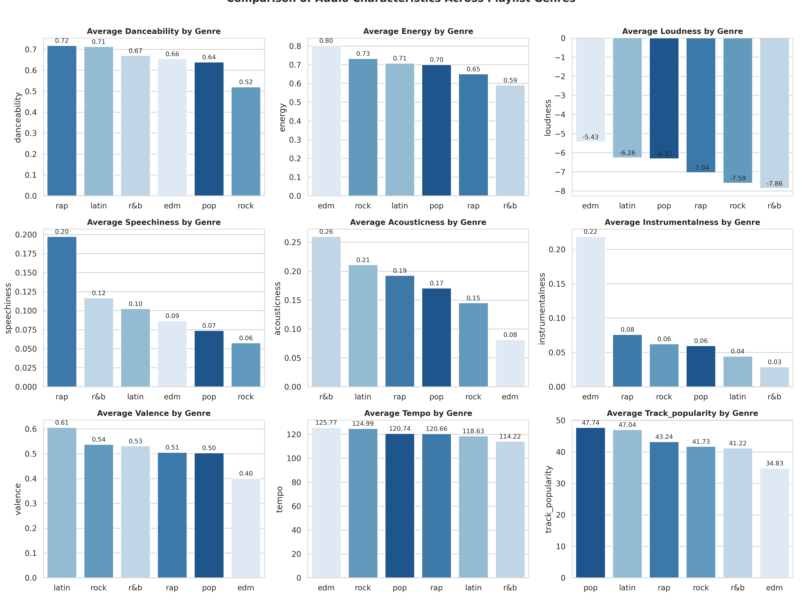

### 5. PCA Explained Variance and Scree Plot
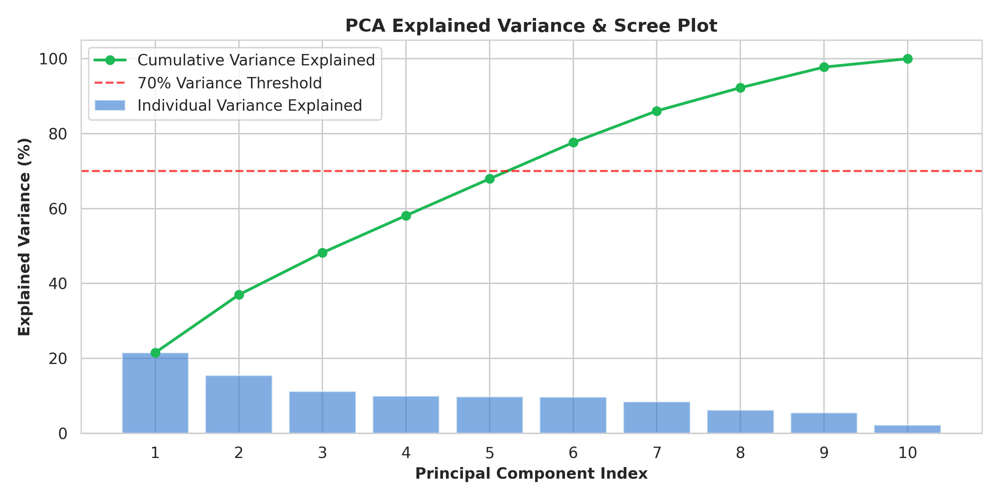

### 6. 2D PCA Space Colored by Playlist Genre
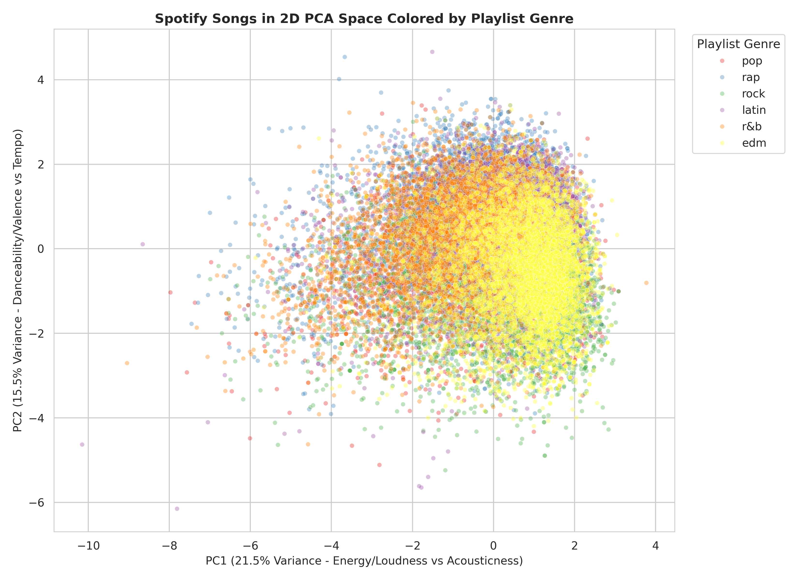

### 7. Cluster Evaluation: Elbow Method & Silhouette Scores
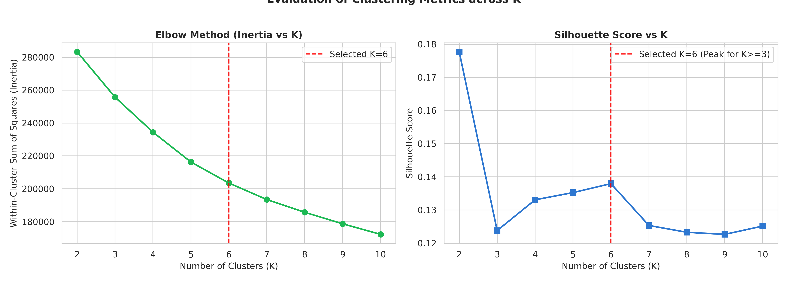

### 8. K-Means Clusters in 2D PCA Space with Centroids
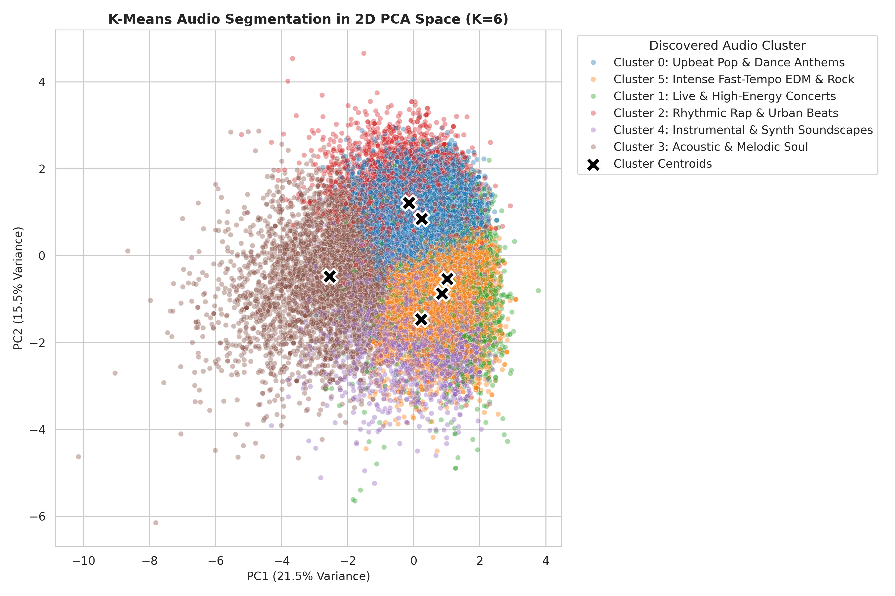

### 9. Mean Audio Feature Profiles per Cluster
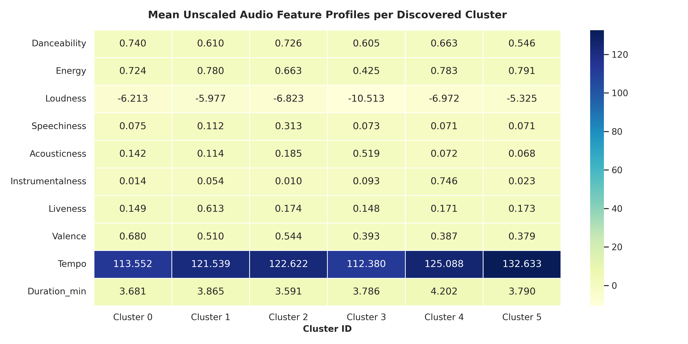

### 10. Cluster Composition by Playlist Genre
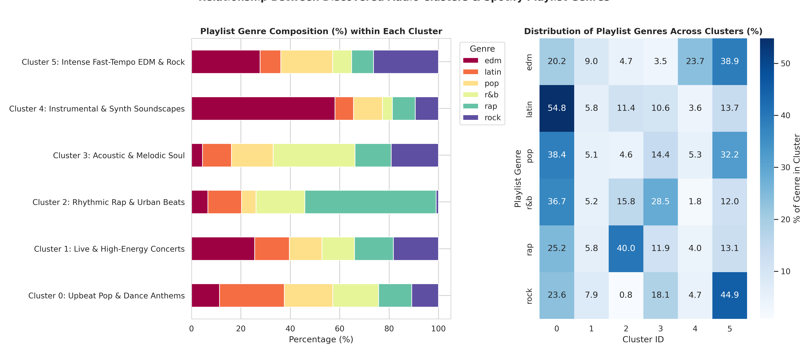

### 11. Cluster Distribution Across Top 10 High-Volume Playlists
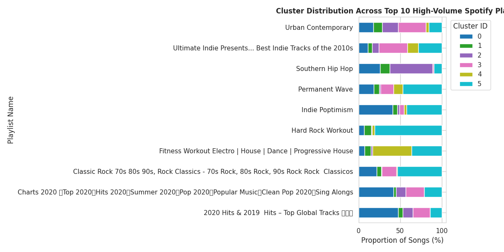

---

## Recommendation System Demonstration
The content-based recommendation prototype uses **Cosine Similarity** over the 10 standardized audio features:
$$\text{Similarity}(\mathbf{u}, \mathbf{v}) = \frac{\mathbf{u} \cdot \mathbf{v}}{\|\mathbf{u}\|_2 \|\mathbf{v}\|_2}$$

### Sample Demonstration Queries

#### 1. Seed: *"Shape of You"* by Ed Sheeran (Pop | Cluster 0)
* **Seed Acoustics:** Dance=0.82, Energy=0.65, Valence=0.93, Loudness=-3.2 dB, Tempo=96 BPM
* **Top Recommendations:**
  1. *Quizas - Remix* by Tony Dize | Latin (reggaeton) | Similarity: **0.9583**
  2. *Brujeria* by El Gran Combo De Puerto Rico | Latin (latin pop) | Similarity: **0.9533**
  3. *No Vuelvas Más* by Darell | Latin (reggaeton) | Similarity: **0.9434**
  4. *Work It Out* by Jurassic 5 | Rap (southern hip hop) | Similarity: **0.9425**
  5. *Me Quedaré Contigo* by El Micha | Latin (tropical) | Similarity: **0.9415**

#### 2. Seed: *"Bohemian Rhapsody - 2011 Mix"* by Queen (Rock | Cluster 3)
* **Seed Acoustics:** Dance=0.41, Energy=0.40, Valence=0.22, Loudness=-9.9 dB, Tempo=71 BPM
* **Top Recommendations:**
  1. *Bohemian Rhapsody - Remastered 2011* by Queen | Rock (classic rock) | Similarity: **1.0000**
  2. *As We Lay* by Shirley Murdock | R&B (new jack swing) | Similarity: **0.9571**
  3. *Jubilee Street* by Nick Cave & The Bad Seeds | Rock (permanent wave) | Similarity: **0.9531**
  4. *The Drugs Don't Work* by The Verve | Rock (album rock) | Similarity: **0.9511**
  5. *Tell Your Friends* by The Weeknd | R&B (urban contemporary) | Similarity: **0.9409**

*Note:* This recommendation component is a content-based vector similarity demonstration, not a production collaborative filtering engine.

---

## Repository Structure
```
spotify-genre-segmentation/
│
├── README.md                                     # Main GitHub documentation
├── LICENSE                                       # MIT License
├── .gitignore                                    # Python/Jupyter gitignore
├── requirements.txt                              # Python package dependencies
├── FINAL_REPOSITORY_QA.md                        # QA validation & verification audit
│
├── src/
│   └── spotify_genre_segmentation.py             # End-to-end Python executable pipeline
│
├── notebooks/
│   └── Spotify_Genre_Segmentation.ipynb          # Clean, presentation-ready Jupyter Notebook
│
├── data/
│   ├── README.md                                 # Dataset schema and ingestion instructions
│   └── spotify_clustered_dataset.csv             # Preprocessed dataset with cluster labels
│
├── reports/
│   ├── Spotify_Genre_Segmentation_Project_Report.md # Formal technical submission report
│   └── FINAL_QA_REPORT.md                        # Multi-metric QA report
│
├── figures/                                      # All 11 generated high-resolution figures
│   ├── 01_correlation_matrix.png
│   ├── 02_genre_subgenre_distribution.png
│   ├── 03_audio_features_distributions.png
│   ├── 04_genre_audio_features_comparison.png
│   ├── 05_pca_variance_scree.png
│   ├── 06_pca_2d_genres.png
│   ├── 07_elbow_and_silhouette.png
│   ├── 08_kmeans_pca_clusters.png
│   ├── 09_cluster_profiles_heatmap.png
│   ├── 10_cluster_genre_cross_analysis.png
│   └── 11_playlist_name_cluster_distribution.png
│
└── outputs/
    └── README.md                                 # Output folder description
```

---

## Installation & Setup

### 1. Clone the repository
```bash
git clone <repository-url>
cd spotify-genre-segmentation
```

### 2. Create and activate a virtual environment
* **Windows:**
```bash
python -m venv .venv
.venv\Scripts\activate
```
* **Linux / macOS:**
```bash
python3 -m venv .venv
source .venv/bin/activate
```

### 3. Install dependencies
```bash
pip install -r requirements.txt
```

---

## Running the Project

Run the master pipeline script from the repository root:
```bash
python src/spotify_genre_segmentation.py
```
The script will:
1. Ingest the dataset from `data/upload_efc975f9-7e96-4804-8ae1-691bc3670af7.csv` (or repository root).
2. Clean and standardize features.
3. Compute and save all 11 plots to `figures/`.
4. Perform PCA and evaluate $K \in [2, 10]$.
5. Fit K-Means ($K=6$) and export `data/spotify_clustered_dataset.csv`.
6. Run 5 sample recommendation queries.

---

## Jupyter Notebook
To explore the analysis interactively:
```bash
jupyter notebook notebooks/Spotify_Genre_Segmentation.ipynb
```

---

## Academic Project Context
This project was developed as **Project 2: Spotify Songs' Genre Segmentation** for the **Corizo Artificial Intelligence Internship**.

---

## Limitations
1. **Unsupervised Nature:** Clusters reflect statistical groupings in continuous audio feature space, which require human domain interpretation.
2. **Feature Scope:** Scalar audio features cannot capture vocal timbres, lyrical semantics, harmonic progressions, or production nuances.
3. **Metric Ambiguities:** Unsupervised validation metrics provide contrasting signals ($K=2$ maximizes raw silhouette, while $K=8..10$ lower Davies-Bouldin scores).
4. **Content-Based Prototype:** The recommender relies strictly on audio feature similarity and does not integrate user listening history, skips, or collaborative filtering signals.

---

## Future Improvements
* **Multimodal NLP Embeddings:** Incorporate lyric sentiment analysis and topic modeling.
* **Deep Metric Learning:** Train autoencoders or Siamese neural networks on raw audio spectrograms.
* **Hybrid Recommender:** Combine content-based audio similarity with collaborative filtering (Matrix Factorization / ALS).
* **Interactive Web Interface:** Build a Streamlit or FastAPI application for real-time track exploration.

---

## Author
**Hamid Kamal**  
*Data Science & Machine Learning Engineer Intern*  
Corizo Artificial Intelligence Internship

---

## License
This project is licensed under the [MIT License](LICENSE).
